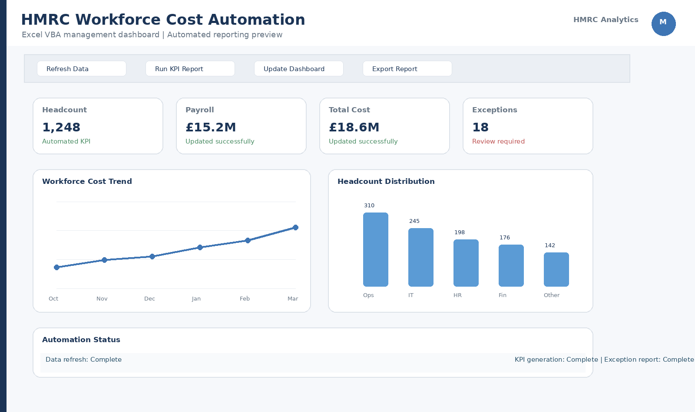
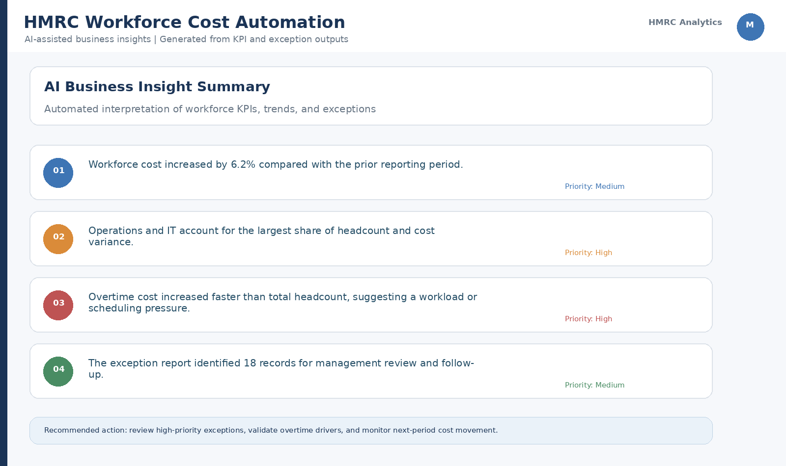

# HMRC Workforce Cost Automation

## Business Problem

Organisations need a repeatable way to monitor workforce levels,
staffing costs and cost efficiency across monthly reporting periods.

This project automates the process of importing workforce data,
calculating business KPIs, identifying material changes, producing
management dashboards and generating business recommendations.

## Objective

Build an end-to-end workforce cost monitoring solution using:

- Python
- SQL
- Excel VBA
- SQLite
- Business Intelligence
- AI-assisted business insight generation

## Data

HMRC workforce and payroll data covering monthly reporting periods.

The project currently processes 18 KPI records and identifies
3 exception records.

## Solution Architecture

CSV Data
→ Python Data Processing
→ KPI Calculation
→ SQLite
→ SQL Analysis
→ Excel VBA Automation
→ Dashboard
→ Exception Monitoring
→ AI Business Insights

## Key KPIs

- Total Workforce
- Total FTE
- Payroll Cost
- Total Staffing Cost
- Cost per FTE
- FTE-to-Headcount Ratio
- Workforce Change %
- Staffing Cost Change %
- Cost per FTE Change %

## Exception Rules

The automation flags:

- Workforce movement >= 2%
- Staffing cost movement >= 5%
- Cost per FTE movement >= 3%

## Automation

The Excel VBA workflow supports:

1. CSV import
2. Exception detection
3. Dashboard refresh
4. Control-sheet validation
5. One-click automation workflow

## AI Business Insight Layer

The Python insight engine converts analytical signals into:

- Management observations
- Business impact
- Recommended actions
- Exception-focused decision support

## Project Outputs

- SQL analytical queries
- Python notebook
- SQLite database
- Excel VBA automation
- Management dashboard
- Exception report
- AI business-insight report

## Skills Demonstrated

Python | SQL | SQLite | Excel | VBA | Macros |
Power BI-ready data modelling | Business Analysis |
Data Automation | KPI Analysis | Exception Monitoring |
AI-assisted Business Insights | Git/GitHub

## Business Value

The solution reduces repetitive reporting work, improves exception
visibility and provides a structured path from raw workforce data
to management decision support.

## Dashboard Preview

### Excel VBA Management Dashboard

### AI Business Insights

